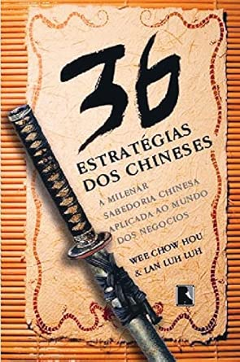
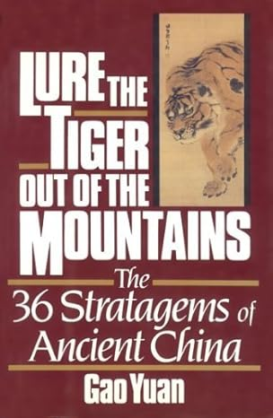
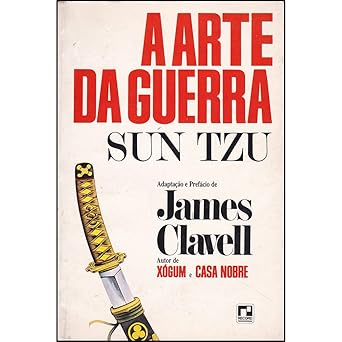
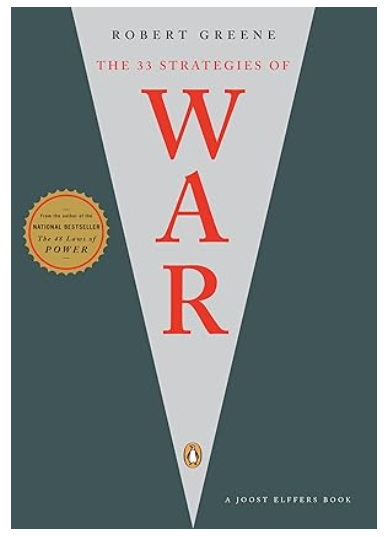

# Conclusão e Bibliografia recomendada

Os 36 estratagemas é um dos tratados de guerra que são referência na história da humanidade. Fiel ao estilo chinês, as estratégias são descrições simples (originalmente escritas em 4 caracteres), metafóricas, mas de significado profundo se compreendidas  em sua essência, e devastadoras quando aplicadas.

Há inumeráveis outros exemplos de uso, que abordo de quando em quando neste espaço, e continuarei abordando, pelo tema ser muito rico, e pelo ser humano ser extremamente complexo.

As 36 Estratégias dos Chineses por Wee Chow Hou 

Lure the tiger out of the mountains: The thirty-six stratagems of ancient China - Gao Yuan 

A Arte Da Guerra - Sun Tzu

The 33 Strategies of War - Robert Greene

