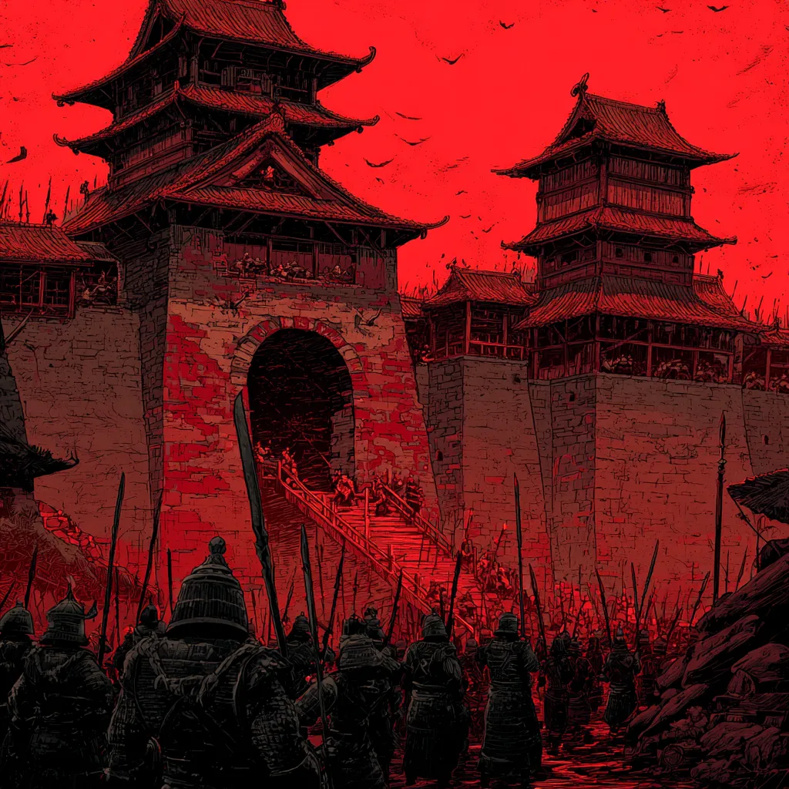
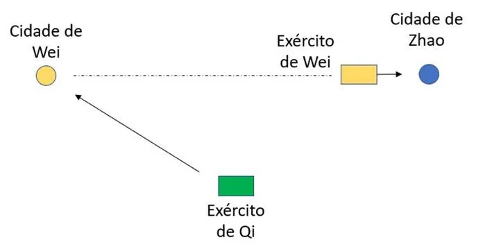

# Estratégia 2 - Sitiar Wei para salvar Zhao

O exército de Wei atacou, venceu e sitiou o estado de Zhao. 

O exército de Qi, aliado da cidade sitiada, veio em socorro a Zhao. Mas isto significava batalhar diretamente com o poderoso exército Wei. 

Entretanto, ao invés disso, marcharam em direção à cidade de Wei, que estava desprotegida de seu exército. Assim que isto ficou claro, o exército de Wei teve que retornar à sua base, as pressas. Zhao foi libertada sem batalha alguma! A estratégia significa evitar o ponto forte do inimigo, e atacar o ponto fraco.

O Yin Yang significa sempre ter em mente as forças complementares, a oposição. Força e Fraqueza, Alto e Baixo.

Evite o forte, ataque a parte fraca! Evite a parte defendida, ataque na parte não defendida!

Da mesma forma, a água percorre o caminho do leito do rio e evita as alturas.

No xadrez, uma forma efetiva de se defender de um ataque é contra-atacar na ala oposta. Ao ataque na ala do rei, contraataque ao centro ou na ala da dama!

