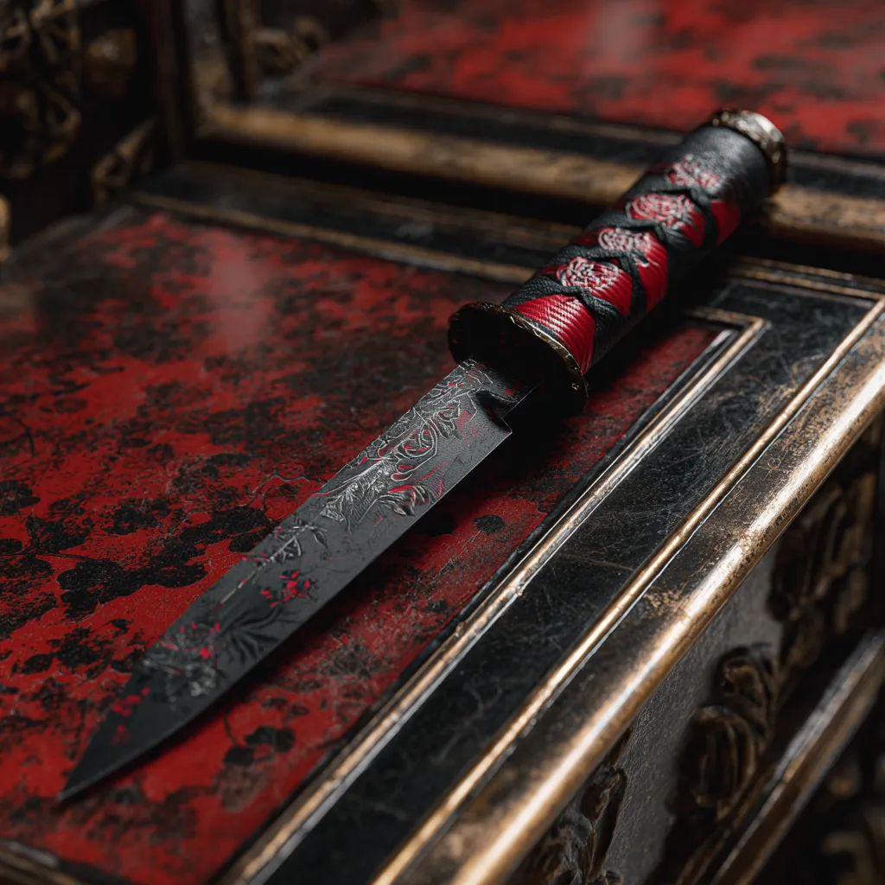
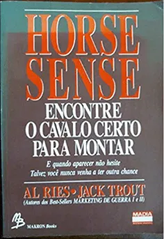

# Estratégia 3 - Matar com uma faca emprestada

Quando não se tem força suficiente para se opor ao inimigo, utilizar a força de aliados ou de grupos para tal: é a “faca emprestada”. 

Se você conseguir outros a atuarem em sua causa, você estará utilizando recursos emprestados para um fim em comum. Uma startup que consegue acessar recursos, know-how e networking de um grande grupo de investimentos é um caso desses.

Este conceito também lembra o de “cavalo a montar”, de Al Ries e Jack Trout.

A ideia principal é que, além de ter habilidade, devemos também ter oportunidades, um cavalo a montar.

Por outro lado, o dono do cavalo precisa de bons jóqueis. É uma troca.

O melhor jóquei não é necessariamente o mais leve, esperto ou forte. Ele também precisa do melhor cavalo. É necessário aliar habilidade com oportunidades.

De modo genérico, todos nós precisamos estar ligados a um grupo maior, a aliados, porque é impossível conquistar trabalhar sozinhos. “Nenhum homem é uma ilha”, já dizia o autor John Donne.

Esta é a parte 3 das 36 Estratégias de Guerra.