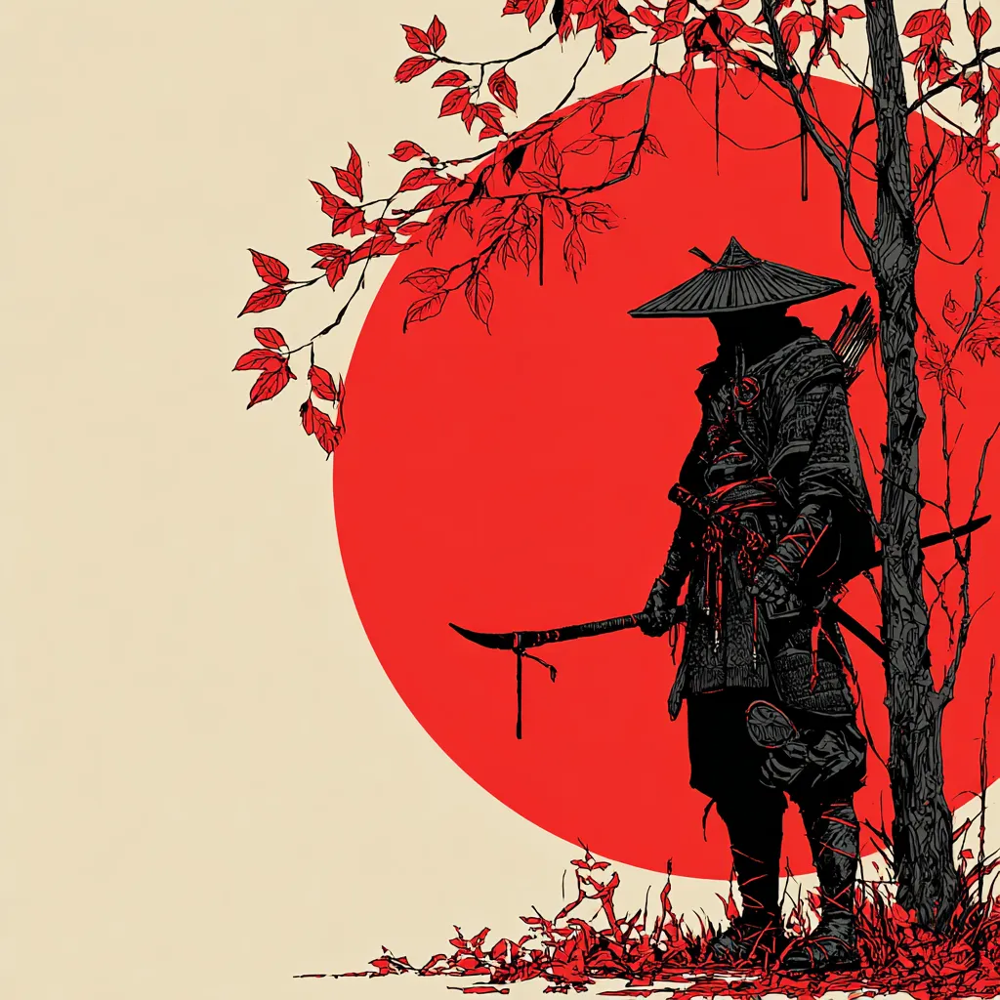
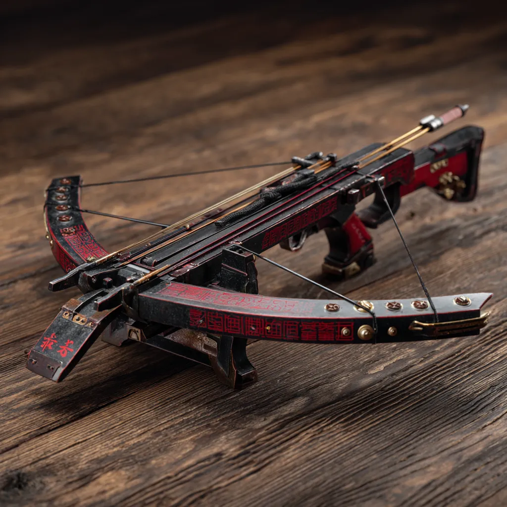

# Estratégia 4 – Poupar energia enquanto o inimigo se cansa

Saber quando utilizar o tempo e o espaço corretos. Um exemplo é chegar cedo ao palco da batalha, escolher o melhor lugar – que tenha a vantagem natural da altura e do espaço de manobra – e esperar o inimigo vir lutando contra o tempo e contra o terreno.

“Quem chega primeiro ao campo de batalha e espera o inimigo estará descansado; quem chega depois e se apressa para lutar estará exausto” - Sun Tzu.

Sempre gostei de estudar um pouco todos os dias, e não deixar tudo para a véspera da prova. Isto é basicamente o oposto do que as pessoas fazem, que é deixar tudo para a véspera. Dosar energia é fundamental para o desempenho.

“A energia é como o retesar de uma besta, a decisão, apertar o gatilho” - Sun Tzu.

Também na linha de dosar energia, cada um de nós tem um ciclo diário em que temos maior concentração. Eu sempre prefiro fazer as tarefas mais difíceis de manhãzinha, cedinho. Além do mais, estar presente em uma reunião ou fazer uma tarefa puramente burocrática vai ocupar o seu tempo, porém não necessariamente vai ser um produto útil para o futuro. Priorizar fazer o mais difícil e útil no seu pico de energia, e o burocrático e trabalhoso no seu vale de energia.

Esta é a parte 4 das 36 Estratégias de Guerra.

