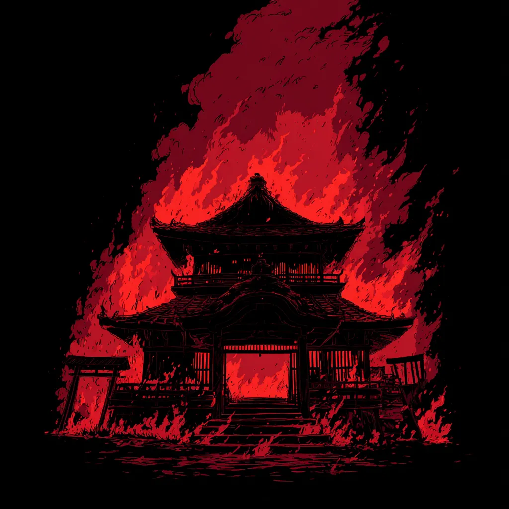

# Estratégia 5 - Saquear uma casa em chamas

Aproveitar a oportunidade de saquear um lugar quando há caos e confusão. Quando o inimigo está numa grande crise, este é o momento para atacar.

Todos temos altos e baixos na vida, e é nos momentos de baixa onde estamos mais vulneráveis.

Infelizmente, esta é uma técnica bastante utilizada por golpistas. As pessoas mais propensas a acreditar num ticket de loteria milagroso, ou num golpe de sorte tipo um jogo do tigrinho, são as mais vulneráveis.

Já dizia Sun Tzu: "Evite o que é forte e ataque o que é fraco".

No mundo dos negócios, há empresas e profissionais especializados em assumir empresas insolventes e prestes a falir, como abutres esperando pela carniça.

No filme “O lobo de Wall Street”, o personagem de Leonardo di Caprio empurra papéis lixo, prometendo retornos enormes, por trás de uma fachada de boa empresa. Um passo na empresa é empurrar tais papeis para fundos de pensão, ávidos por grandes retornos (que não virão) e propensos a acreditarem em aparências. 

Outro filme “Uma linda mulher”, o personagem de Richard Gere é um predador corporativo. Comprar empresas em dificuldade, desmontá-las, vender partes separadamente e lucrar com isso. Ao longo do filme, há justamente uma mudança no personagem: ele começa a questionar esse modelo destrutivo de negócios e considera passar a construir empresas em vez de apenas desmontá-las.

Ação: Tome cuidado, nos inevitáveis momentos de baixa.

Esta é a parte 5 das 36 Estratégias de Guerra.

