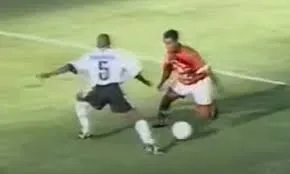

# Estratégia 6 – Simular um ataque ao leste, mas atacar a oeste

A dissimulação está na essência da estratégia. O inimigo não pode concentrar forças em todos os lugares. A estratégia consiste em ocultar as suas verdadeiras intenções e fazer o inimigo concentrar forças no local errado.

Já dizia Sun Tzu: “Se você se defende a leste, estará vulnerável a oeste. Se você se defende a oeste, estará vulnerável a leste. Se você se defender em todos os pontos, estará vulnerável em todos os pontos”. 

Portanto, devemos acertar qual o foco para conseguirmos ser efetivos.

E, também de Sun Tzu: “Toda a guerra é baseada em enganar o oponente”.

Um jogador de futebol que aparenta um drible para a direita, mas vai para a esquerda. Um jogador de poker que blefa com as cartas que tem.

Para qual lado vai o Romário?

No Dia-D, invasão da Europa pelas forças aliadas, a dissimulação foi tão bem sucedida que, mesmo após a invasão ter sido realizada, o alto comando nazista não acreditava que isto estivesse ocorrendo.

Não seja tão transparente em suas intenções, quando tiver um oponente. Dê um drible nele.

Esta é a parte 6 das 36 Estratégias de Guerra.