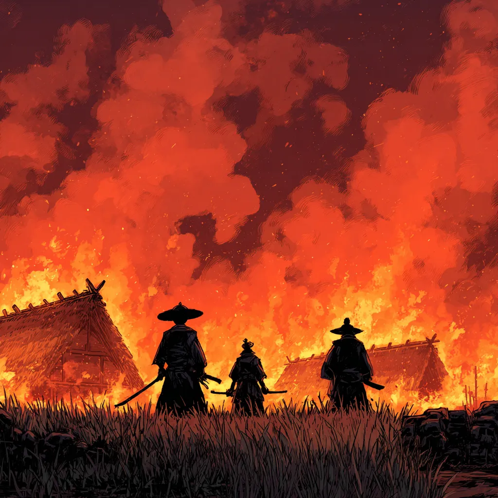

# Estratégia 9 - Observar o fogo do outro lado do rio

Quando houver desordem e lutas internas entre as forças do inimigo, deve-se esperar enquanto este se enfraquece.

Ou, como disse Napoleão Bonaparte, “Nunca interrompa o inimigo quando ele estiver cometendo um erro”

Isso também lembra um conto de Esopo. Estavam um leão e um urso brigando por um pedaço de carne. 

O primeiro, por se achar no direito de ter uma porcentagem, dado ser o rei da selva. O segundo, por ter feito a caça. Uma raposa ficou escondida, vendo tudo, e esperou eles se digladiarem por algum tempo. Até, que, subitamente, a raposa pegou a carne e fugiu correndo…

Esta é a parte 9 das 36 Estratégias de Guerra.