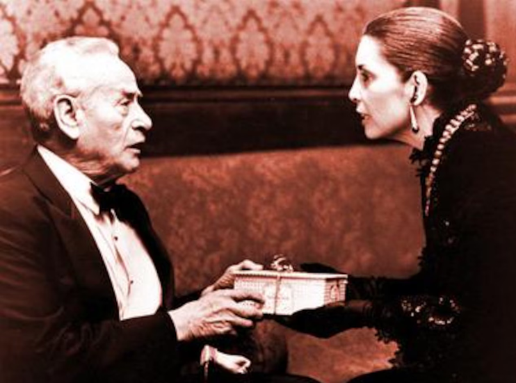

# Estratégia 10 - Uma adaga atrás de um sorriso

Conquistar a confiança do inimigo, para desarmá-lo. O que parece fraco (macio) por fora, pode ser forte (duro) por dentro. Esconda uma adaga atrás de um sorriso.

Na Arte da Guerra de Sun Tzu, há uma frase memorável a respeito:

Quando capaz, finja incapacidade; quando ativo, finja inativo. Quando perto do objetivo, finja estar muito longe; quando muito longe, faça com que pareça perto.

Por outro lado, não confie em sorrisos, palavras amigáveis. 

Algumas das piores pessoas que conheci eram muito agradáveis por fora. 

Confie nos atos da pessoa, no que ela faz, não no que ela diz. No mundo financeiro, o autor Nassim Taleb diz, de forma equivalente, “mostre-me sua carteira de investimentos”, mostre o que você faz, e não apenas palavras.

No filme “O Poderoso Chefão III”, Don Altobello é um dos líderes da máfia siciliana em Nova Iorque. Nas primeiras cenas, mostra-se um velho prestes a se aposentar, sendo muito gentil e parecendo não ter nenhuma intenção para com a família Corleone.

Porém, uma série de ataques depois, a família descobre que é exatamente ele quem é o cérebro por trás de tudo.

Há uma cena icônica, em que a irmã de Don Corleone (a Connie Corleone) entrega cannolis envenenados a Don Altobello. Ele, desconfiado, abre a caixa e pede para ela experimentar um, agradecendo muito e dizendo ser uma retribuição. Ela pega um dos doces e come, de forma desconfortável.

O que Altobello não sabia era que os doces do meio da caixa estavam envenenados, não os de cima. Connie desconfiava que o mafioso fosse astuto o suficiente para testá-la, e assim conseguiu ludibria-lo. Altobello comeu um dos doces envenenados no meio da peça de teatro, e assim os Corleones conseguiram eliminar este oponente.

Esta é a parte 10 das 36 Estratégias de Guerra.
