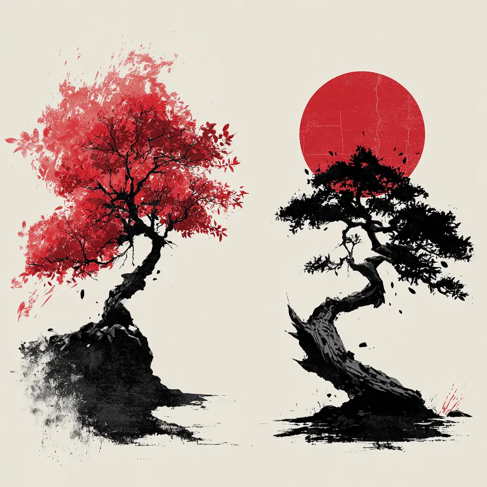
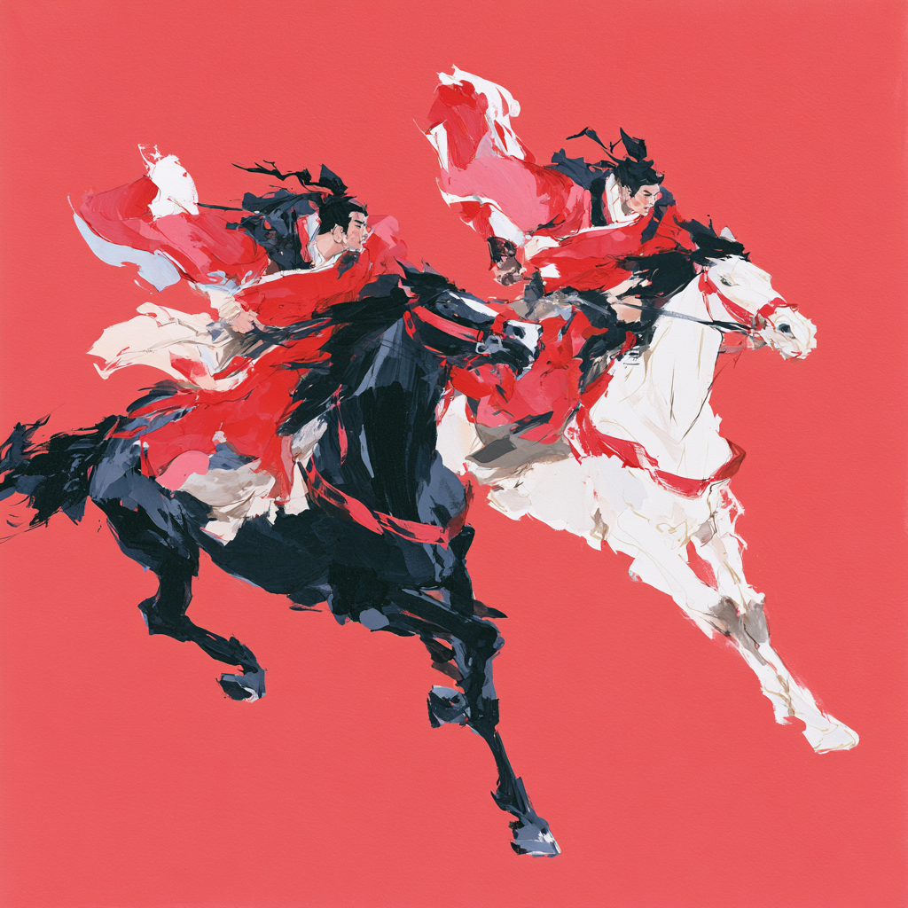

# Estratégia 11 – A ameixeira morre no lugar do pessegueiro

Fazer sacrifícios quando perdas são inevitáveis. O poema significa que essas duas árvores são tão íntimas que uma está disposta a morrer pela outra.

É o popular “perder os anéis para salvar os dedos”. Perder uma batalha para salvar a guerra. Perder um cavalo para salvar a dama.

Uma empresa, quando em crescimento e com capital sobrando, usa o mesmo para expandir sua linha de produtos e comprar outras empresas. Quando a maré muda, é o oposto: é preferível sacrificar linhas de produto e fechar fábricas do que tentar manter tudo e perder tudo.

Exemplo: A corrida entre Tian Ji e Sun Bin

Tian Ji e Sun Bin, dois generais da antiguidade, tinham 3 cavalos cada, e eles eram equivalentes: tanto o mais rápido, o médio e o mais fraco chegavam praticamente empatados.

Sun Bin pensou numa forma de vencer a disputa, sacrificando um de seus cavalos: fez o seu mais lento correr e perder contra o mais rápido do oponente. A seguir, o seu cavalo médio venceu o cavalo mais lento, e o seu mais rápido venceu o médio do oponente.

Em ocasião de batalha, Sun Bin fez o mesmo: sacrificava a parte fraca de seu exército para distrair a atenção da parte forte do inimigo, para então utilizar o seu ponto forte contra a parte fraca do oponente, causando estrago extremamente maior.

Em nível pessoal. Sempre queremos fazer mais coisas do que somos capazes. Digamos, eu quero fazer aulas de violino, porém, não tenho tempo livre e estou priorizando estudar uma nova ferramenta computacional. Desejos são infinitos, nosso tempo e capacidade cognitiva, não. Necessariamente temos que priorizar, de alguma forma. Ter tempo é uma questão de priorização.

É a lei do sacríficio, uma das 22 leis do marketing de Al Ries e Jack Trout: "para conseguir uma coisa, você deve sacrificar todas as outras".

Segundo o economista Grigory Mankiw, uma das leis da Economia é o **custo de oportunidade**. O verdadeiro custo de você optar por algo é desistir de todas as outras opções. O custo de oportunidade está presente em todas as facetas de nossas vidas.

“A vida é como um self service. Você pode pegar o que quiser, mas tem que pagar por isso” - Gilcler Regina

Esta é a parte 11 das 36 Estratégias de Guerra.