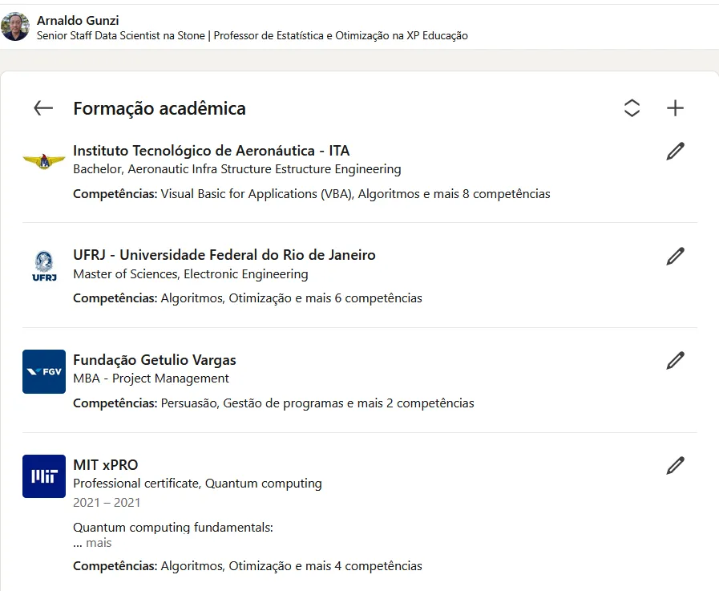

# Estratégia 12 – Roubando um bode pelo caminho

Aproveitar uma oportunidade de ganho fácil, por menor que seja. Aproveitar as vantagens que surgem pelo caminho. Aproveitar os erros do seu adversário.

Quando eu trabalhava na Aeronáutica, surgiu a oportunidade de fazer um MBA em Gerência de Projetos. É que é assim, a área estima uma quantidade de vagas, pede todos os anos, e muito de vez em quando alguns desses pedidos eram contemplados. 

Pois bem, neste ano em específico, tinham duas vagas, e nenhum dos oficiais mais antigos do que eu queria fazer, por diversos motivos (já estavam fazendo outras atividades, tinham outro trabalho paralelo, etc). 

Eu também tinha um problema: já estava fazendo mestrado em Eletrônica na UFRJ… e trabalhando na Aeronáutica. Aceitei assim mesmo, se tivesse que me matar por dois anos para concluir tudo, que assim fosse. Eu era solteiro e jovem, então o timing era bom para isso.

Um MBA a mais no currículo não é nada mau.

Bom, em resumo, “roubei o bode” que surgiu no meu caminho.

No xadrez, quando jogam dois grandes mestres de alto nível, o jogo tende a empatar, então eles devem aproveitar qualquer imprecisão mínima na jogada do outro.

Muita gente recusa oportunidades por “não estarem preparados”, estarem “ocupados” ou coisa similar.

Já dizia Pasteur, “A sorte favorece a mente preparada”.

Olha, não é todo dia que surge um bode de graça no caminho. Nas raras ocasiões em que isso acontecer, aproveite! Nunca mais a oportunidade aparecerá novamente.

Esta é a parte 12 das 36 Estratégias de Guerra.

