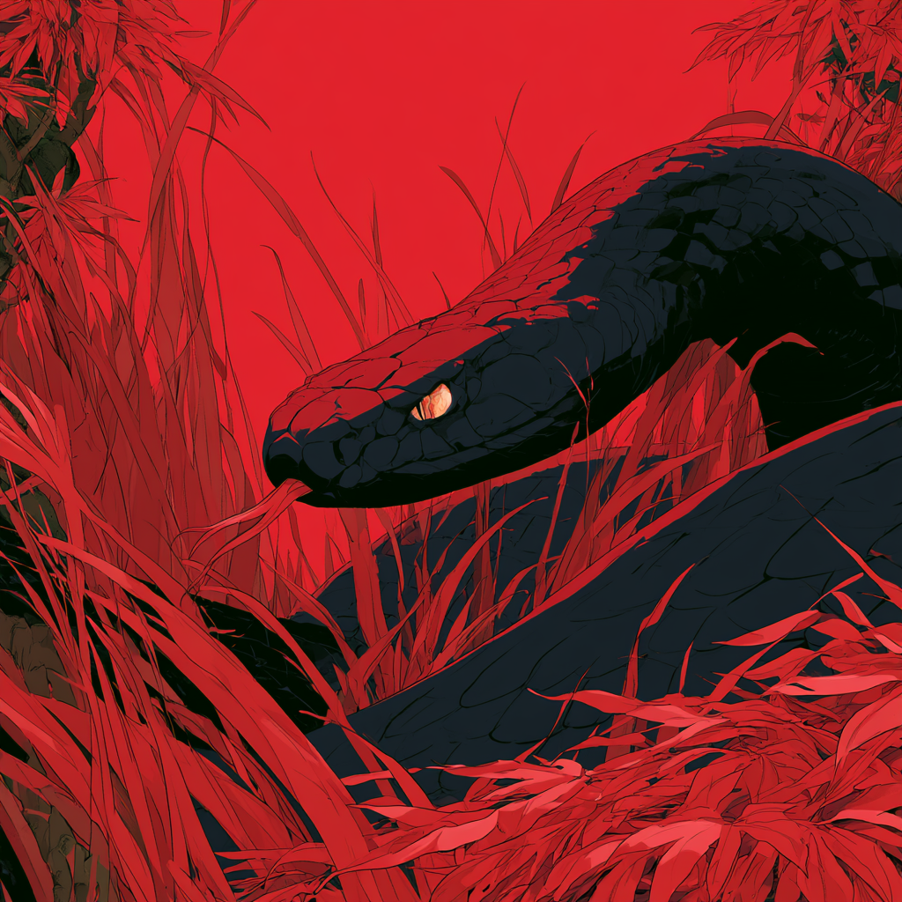

# Estratégia 13 - Bater no capim para assustar a cobra

Ao invés de capturar a cobra, deve-se assustá-la dando batidas no capim, e fazer a captura quando ela aparecer. É uma estratégia ofensiva, para fazer o inimigo revelar as cartas que tem na manga. 

É como uma reunião inicial, para tentar dar uma sondada nas intenções do interlocutor.

Um exemplo é fazer um lance inicial alto num leilão, para testar quem quer realmente bancar a concorrência.

No contexto de uma empresa, é comum fazermos testes piloto de uma alteração no processo, ou utilizar um novo fornecedor aos poucos. Ou, utilizando terminologia de inovação, fazer um produto mínimo viável (MVP).

Se o novo processo rodar bem, o fornecedor for bom ou a recepção do público for boa, podemos pegar o teste inicial e produtizar o mesmo de forma mais robusta.

Num contexto mais romântico, um primeiro encontro ou um início de namoro vai te dar infinitamente mais informação do que podemos obter sobre a pessoa na internet. 

Quem sabe, você não evita uma verdadeira cobra!

