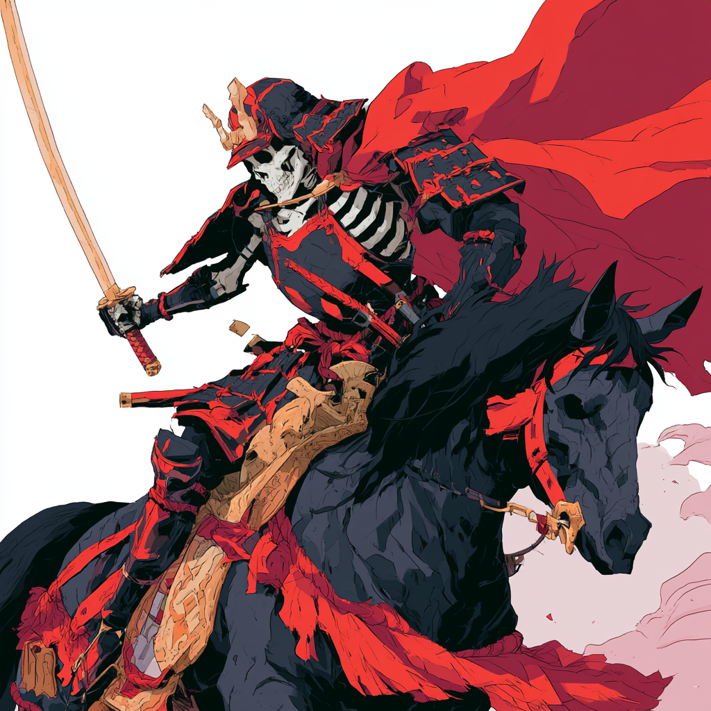
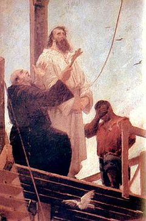
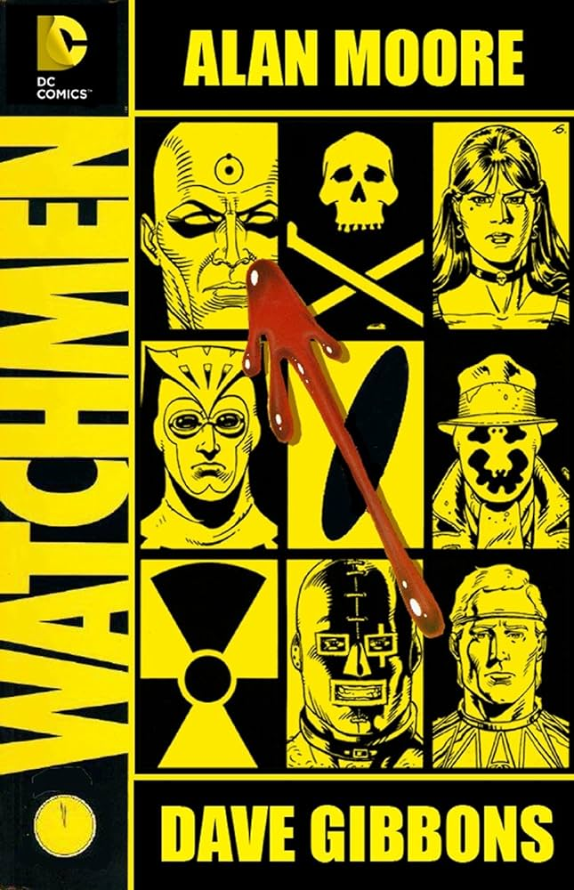

# Estratégia 14 - Tomar um cadáver emprestado para ressuscitar uma alma

Uma pessoa fraca pode requerer sua assistência para ficar forte e conseguir se opor ao inimigo. Por outro lado, mesmo o exército forte precisa da ajuda de vários exércitos fracos para chegar aos seus objetivos.

Um exemplo muito bom é o Natal. Jesus não nasceu no dia 25 de dezembro. O Natal no dia 25/dez só surgiu no século IV, aproveitando que vários povos já comemoravam esta data como sendo o solstício de inverno. Ou seja, tomaram um cadáver (data comemorativa de povos conquistados pelo Império Romano) para ressuscitar uma alma (tomar para si esta comemoração).

Há inúmeros outros exemplos na história. Imperadores fantoche ocorreram diversas vezes. Um exemplo: o Japão invadiu a Manchúria, nos anos 1930. Para dar um ar de legitimidade, recolocaram no poder o último imperador anterior, Pu-Yu, que não mandava em nada na realidade.

Outro exemplo é o de Tiradentes. Ninguém deu bola para ele, quando morreu em 1792. Virou herói nacional após a proclamação da República, em 1889, 100 anos depois!

O Brasil da República precisava de um herói, e, utilizando a estratégia de tomar um cadáver emprestado, criaram toda a mística ao redor do arrancador de dentes que lutara pelo Brasil!

No contexto empresarial, uma vez eu peguei um projeto que já existia, porém estava em baixa, para aproveitar que o fórum já rolava, inserir novas ideias e mudar este para o caminho que eu imaginava desde o início! Seria muito mais difícil criar mais um espaço na agenda de um monte de gerentes para inserir inovações.

No contexto de filmes, mídia e publicações, isso ocorre direto, basta ver que as versões N de uma franquia conhecida expandem uma história que já deveria ter terminado: Star Wars, Velozes e Furiosos, etc.

Destaco por exemplo, o Watchmen original de Alan Moore e Dave Gibbons. De início, os personagens (Coruja, Comediante, Dr. Manhattan) eram heróis bem meia boca provindos de direitos autorais comprados junto à uma editora antiga, a Carlton Comics.

Na mão de Moore e Gibbons, este virou um dos maiores clássicos cult dos quadrinhos de todos os tempos!

Lembre-se desta estratégia, no próximo feriado de Tiradentes!