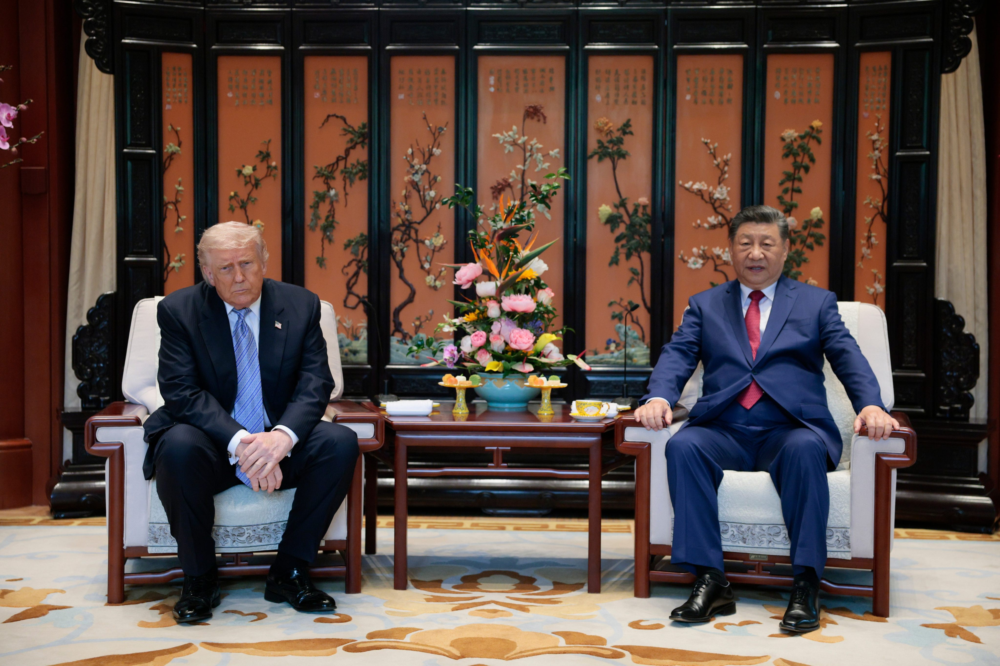

# Estratégia 15 -  Atrair um tigre para fora de sua toca 

Um tigre é muito forte em seu estado natural, mas vai se retrair em ambiente desconhecido. Imagine um tigre no deserto, ao invés da floresta…

Uma estratégia de negociação é chamar o outro lado para uma reunião, e colocar muita gente do seu time por muito tempo para fazer pressão em cima do oponente.

Para quem gosta de futebol, um tigre fora de sua toca é como jogar fora de casa, com a torcida contra, com os gandulas contra, com todo o ambiente desfavorável.

Estando em seu território, é possível projetar poder. Neste encontro de Xi Jinping e Trump, em 2026, o assento do norte-americano “afunda” mais, o que coloca o seu par chinês numa posição maior. Estratégia assim já foi utilizada inúmeras vezes.

E como fazer o tigre sair da montanha? Que tal oferecer alguma coisa para ele vir? Ou marcar num território supostamente “neutro”, e conveniente a ambos? Muitas vezes, um simples convite é suficiente.

Algumas variações: chamar o chefe para almoçar quando quiser pedir aumento, é melhor do que no escritório dele. Levar a sua paquera para um lugar especial, a fim de pedi-la em casamento.

Esse tema também lembra o belo poema “The Tiger” de William Blake:

Tiger, tiger, burning bright,
In the forest of the night,
What immortal hand or eye
Could frame thy fearful symmetry?

