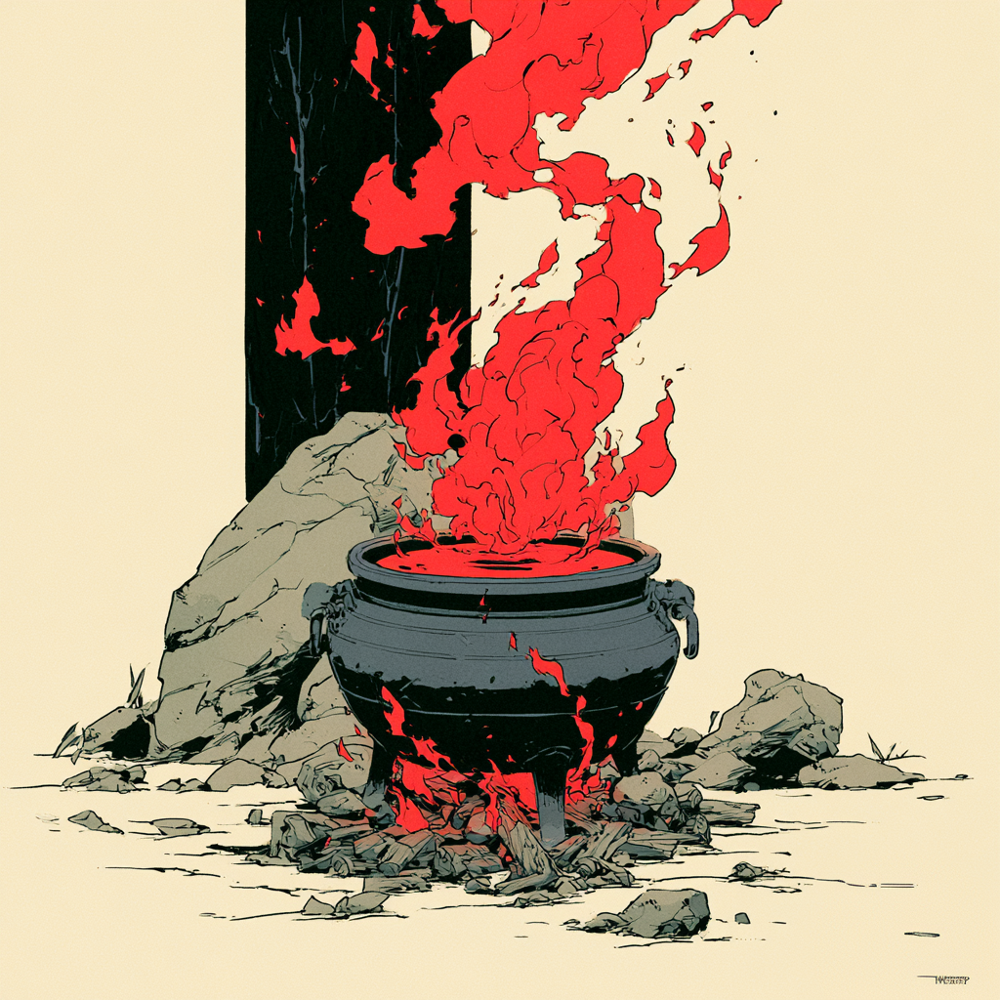

# Estratégia 19 – Tirar a lenha de debaixo do caldeirão

Ao invés do confronto direto, utilizar táticas para minar a moral do inimigo. 

Retire a lenha, para evitar que a água ferva, corte a grama destruindo as raízes.

A estratégia vem da seguinte história.

O grande Confúcio era conselheiro do imperador de Lu, o que fazia com que este tivesse força e sabedoria. A fim de atacar Lu, o inimigo primeiramente tirou Confúcio da jogada. Ele fez oferendas de ouro, presentes, bebidas, cavalos e oitenta beldades para o imperador de Lu. Este aceitou as oferendas e passou a levar uma vida de libertinagem, ignorando Confúcio, que pediu exoneração do cargo meses depois. Sem a sabedoria de Confúcio, o império Lu foi facilmente manipulado e conquistado, anos depois.

Se, na estratégia 18, a ideia era atacar o líder, nesta é atacar o seu suporte.

Numa negociação, às vezes o diretor da área não tem conhecimento técnico o suficiente para discernir entre soluções. Então, é a pessoa técnica do seu time é que deve ser convencida e, aí sim, esta convencerá o diretor sobre o rumo a tomar.

Um time de futebol que tem apenas atacantes bons, mas não o meio-campo, nunca se destacará em nada.

Nas empresas, nesses tempos atuais de "eficiência operacional" e corte de custos, é perigoso tirar a lenha do caldeirão de si mesmo e o corte ter consequências péssimas.

É como uma aranha, que tem oito patas. 

Você tira uma pata, a título de "eficiência operacional", "fazer mais com menos" e ela continua andando. Tira duas patas, três, até que chega uma hora que… ela não aguenta mais, e ela tomba.
    
Cuidado para não retirar lenha do seu próprio caldeirão!
