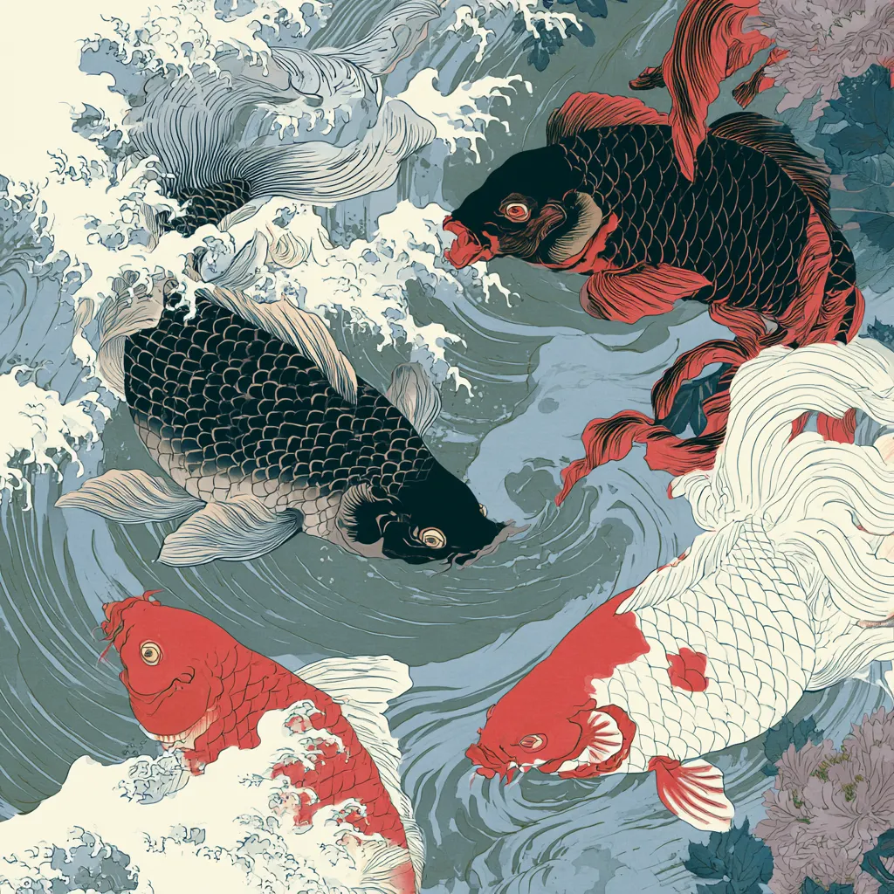
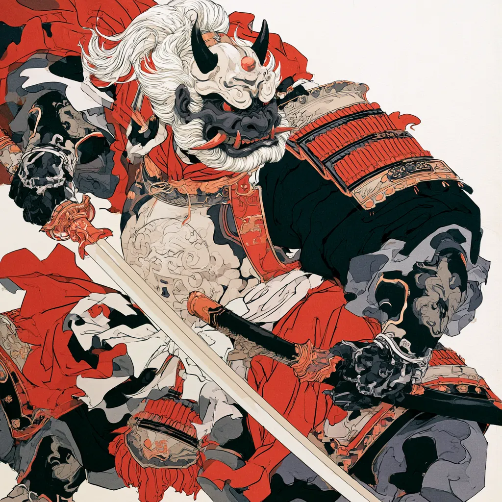

# Estratégia 20 – Tornar as águas turbulentas para pegar um peixe

Fazer um lamaçal para o peixe ficar confuso e capturá-lo. Um exército confuso proporciona a vitória ao inimigo.

A tática de criar ruído é comumente utilizada. 

Tinha uma pessoa da TI, em uma das empresas que trabalhei, que quando não o beneficiava fazer um trabalho, vinha sempre levantando uma série de objeções, como problemas legais, necessidade de maior estudo, mensurar melhor as "dores do problema" e assim sucessivamente. Não importa o quanto a gente avançava em algum assunto, sempre ele trazia a necessidade de "estudar mais", e nada rodava...

Em 496 a.C. as tropas do reino de Yue fizeram uma manobra inesperada, numa batalha contra o reino de Wu. Uma fileira de soldados de Yue marchou à frente, desembainhou as espadas e cortou as próprias gargantas.

Sem entender absolutamente nada do que ocorrera, as tropas inimigas entraram em choque, possibilitando um momento de confusão e de ataque concentrado do primeiro. Mal eles sabiam que a tropa suicida era de condenados à morte, e que tinham duas opções: cometerem tal suicídio espantoso ou serem executados pelas tropas de Yue.

No Xadrez, mesmo numa posição perdida, quando o oponente ataca por um lado, você contra-ataca pelo outro lado, ou pelo centro. Ou coloca uma peça importante, como uma torre, como um alvo atacável no outro flanco.

De forma geral, o lado que estiver em desvantagem deve tentar fazer alguma coisa para tumultuar o ambiente, distrair o adversário. Já, quem estiver em posição vantajosa, deve focar no que interessa e ignorar distrações.

O blefe pode dar certo ao distrair a atenção do oponente.

Algumas dicas para evitar a confusão:
    Canais de comunicação eficientes
    Procedimentos claros
    Feedback preciso

Outra interpretação possível deste estratagema diz respeito à isca. O peixe é alvo que queremos obter, e pela analogia da pesca, temos a isca.

Seja dinheiro, poder, influência, sexo oposto, há algo na isca que atrai a atenção do alvo.

Dizem os livros antigos, que "Pega-se o peixe pequeno com uma linha fina e isca visível; o peixe médio com uma linha proporcional e uma isca apetecível; o peixe grande com uma linha grossa e uma isca grande. Com o homem, é o mesmo."

