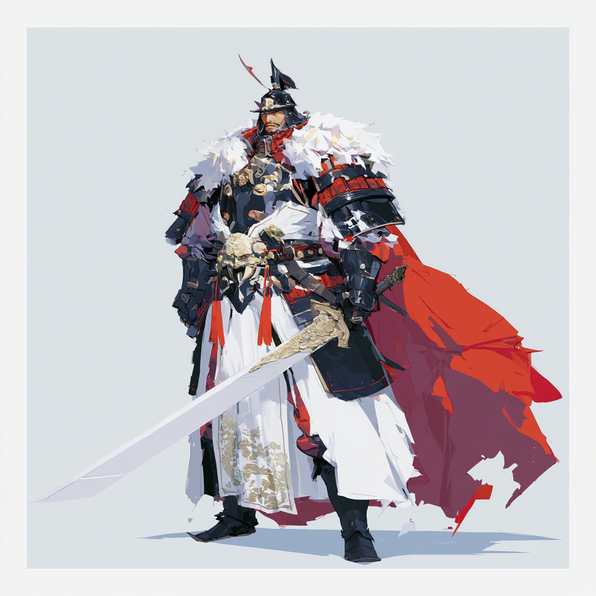
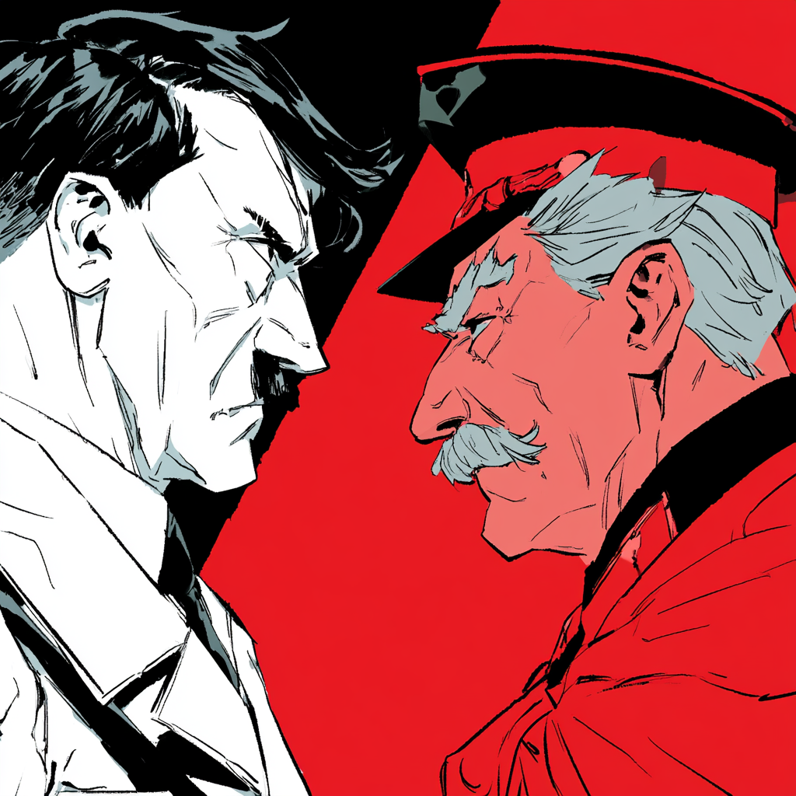

# Estratégia 21 - Mudar de pele como uma cigarra dourada

Escapar sem ser percebido, como a cigarra que muda de pele. Utilizar uma pele específica segundo a circunstância. Adaptar-se à mudanças que ocorrem constantemente no meio-ambiente.

Há pessoas que são, naturalmente, mestres nisso. Mudam de opinião conforme o chefe muda de humor. Autêntico "Maria-vai-com-as-outras".

O grande guerreiro da época dos Três Reinos, Lu Bu, era um hóspede / prisioneiro incômodo no reino de Shao.

Um dia, o Rei de Shao liberou Lu Bu para retornar ao seu Estado, porém, logo achou que estaria "devolvendo um tigre à montanha". Lu Bu era perigoso demais para ficar vivo. Enviou junto uma tropa de 30 homens, com o pretexto de ser uma escolta para o guerreiro.

À noite, Lu Bu convidou um de seus comandantes para jogar um jogo de tabuleiro. Ficaram em sua tenda, por horas, até que luz da tocha se apagasse.

Quando os soldados de Shao entraram na tenda para proceder à execução, encontraram apenas um boneco de pano e algodão. Lu Bu fugira, há tempos!

Um episódio famoso da Segunda Grande Guerra foi o pacto de não agressão entre Alemanha e União Soviética. Hitler e Stalin se odiassem mutuamente e todos sabiam que era um pacto temporário. Uma questão de tempo até que um dos dois descumprisse o acordo.

O tempo ganho foi utilizado para a Alemanha focar em atacar o oeste europeu (França, Inglaterra), para ambos os pactuantes dividirem a Polônia, e para a URSS se preparar para a guerra que inevitavelmente chegaria.

Alguns anos após o pacto, a Alemanha quebrou o tratado e invadiu a URSS. Stalin "mudou de pele" conforme circunstâncias.

Em uma grande empresa, uma forma de mudar a pele é utilizar consultoria. Para fazer cumprir alguma medida impopular de redução de custos e de pessoal, ou ratificar alguma estratégia que seria tomada de qualquer forma, é comum o uso de consultorias, a fim de dar um ar de isenção e legitimidade técnica. De certa forma, é o outro lado da moeda da Estratégia 3, de utilizar uma faca emprestada, é o contratante do serviço.

Em âmbito pessoal, mudamos de pele todos os dias. Eu sou uma pessoa quando trabalhando, ou numa ocasião de negócios. Em casa, com a família e longe de pressões sociais, posso "tirar a armadura" e ser algo mais próximo de mim mesmo.

