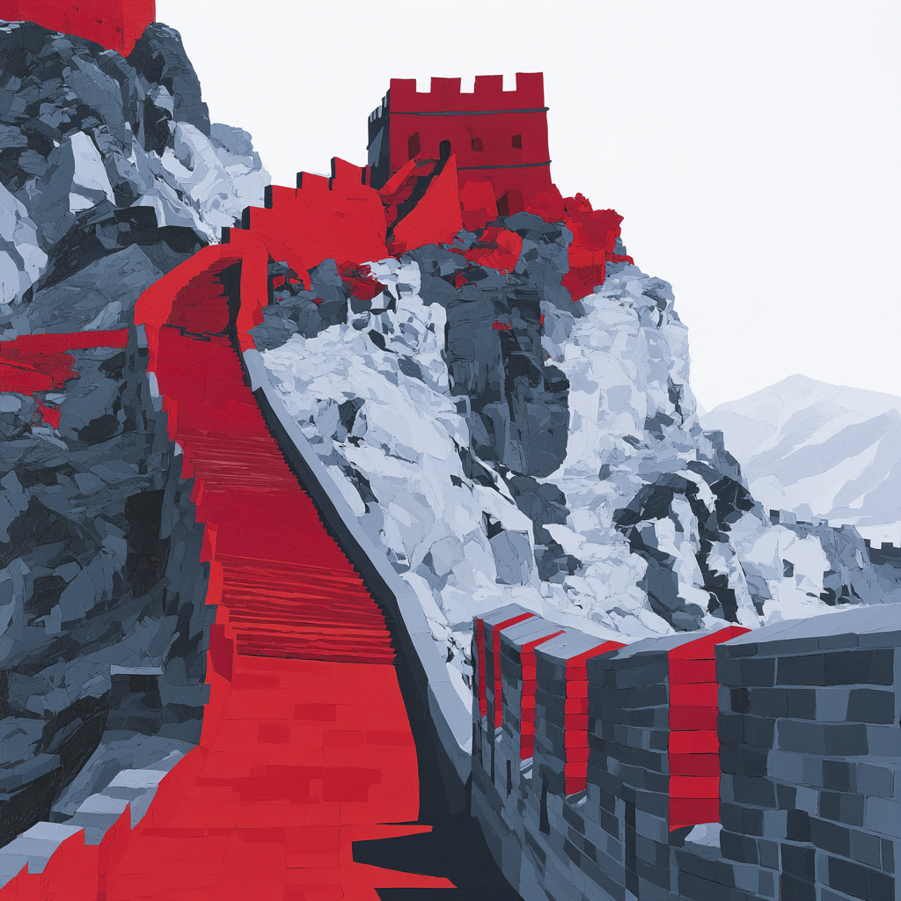

# Estratégia 22 – Fechar as portas para pegar o ladrão

Quando o inimigo é fraco, ele perde o espírito de luta ao se ver cercado como o ladrão preso na numa casa. 

A estratégia de "fechar a porta" pode ser interpretada como fazer um cerco, privar o adversário de todos os recursos externos.

Cerco a cidades muradas é uma estratégia antiga e muito utilizada. Tentar furar a proteção de uma cidade murada é difícil, inevitavelmente levará a enormes baixas. Já o cerco é uma forma indireta de ataque, de sufocar o inimigo, que vai, lentamente, padecendo. É necessário ter paciência e determinação para manter o cerco.

Júlio César, o grande general romano, era famoso por utilizar tal estratégia. Contra os gauleses, por exemplo, foi feito um cerco prolongado. Após alguns meses, todos os recursos do adversário estavam exauridos, e eles foram forçados a se renderem. 

Júlio César, era um brilhante estrategista, mas os engenheiros dele eram tão importante quanto os guerreiros, as espadas e as flechas. O exército romano era capaz de se mover velozmente, abrir estradas, montar cercos e verdadeiras fortalezas a fim de sobrepujar o inimigo!

Sun Tzu diz "Se nossas forças forem dez vezes maiores que as do inimigo, devemos cercá-lo; se cinco vezes maiores, atacá-lo; se duas vezes maiores, dividi-lo."

Há ainda outra máxima de Sun Tzu:

"Quando cercar um exército, deixe uma saída livre."

A ideia é que um inimigo sem esperança luta com desespero. Muitas vezes é melhor oferecer uma rota de fuga e destruir sua capacidade de resistência com tal tentação de refúgio, do que oferecer a ele a luta total como última saída.

No mundo dos negócios, há vários cercos possíveis: barreiras regulatórias, jurídicas, patentes, conhecimento e pessoas especializadas. As grandes empresas vivem colocando inúmeras dessas barreiras, a fim de manter a sua posição frente a concorrentes menores e mais inovadores.

Para aplicar a estratégia de "fechar a porta", é necessário ter uma força superior em montar e manter a barreira.

