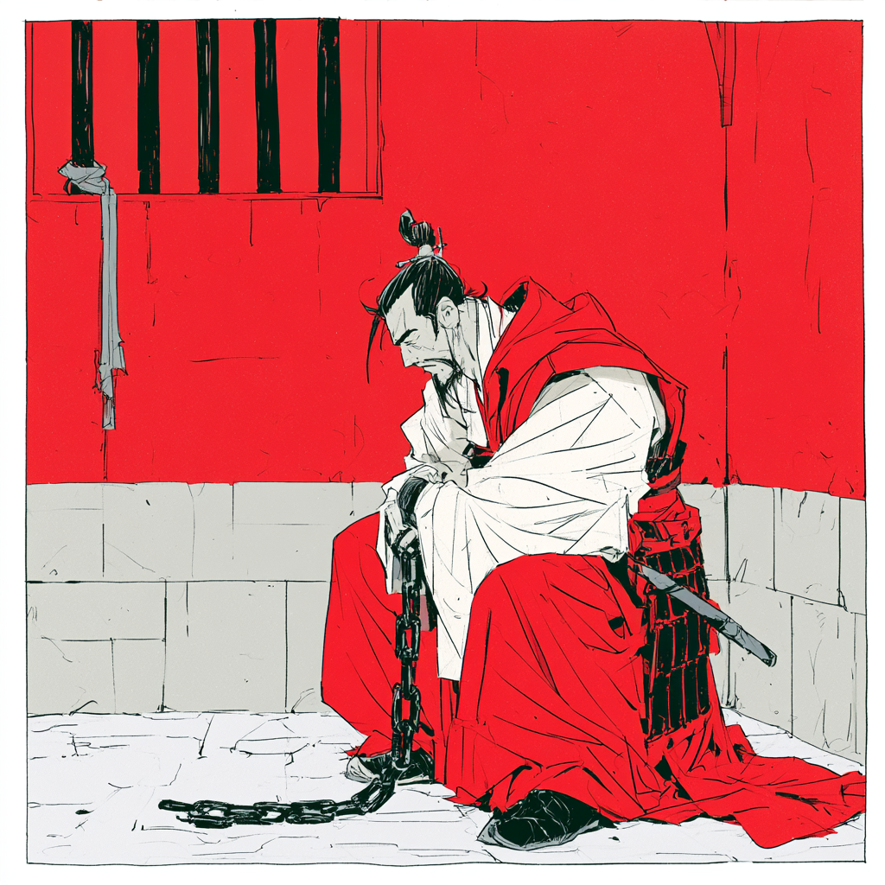

# Estratégia 22 – Fechar as portas para pegar o ladrão

Quando o inimigo é fraco, ele perde o espírito de luta ao se ver cercado como o ladrão preso na numa casa. 

Sun Tzu diz, quando a vantagem for de 10 para 1, cerque-o por todos os lados.
