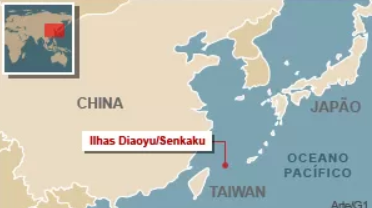

# Estratégia 24 – Passagem emprestada para atacar Guo

Pode ser interpretado como uma estratégia para obter passagem livre por um obstáculo. No caso do título do capítulo, o reino de Jin obteve passagem livre de um terceiro estado para atacar e conquistar o reino de Guo. 

O exército americano, quando em guerra contra o Vietnã, utilizou bases militares instaladas na Tailândia e nas Filipinas, estados aliados. Seria extremamente mais difícil batalhar sem áreas de apoio.

Às vezes vemos no noticiário duas nações se bicando diplomaticamente por uma ilha perdida no meio do nada, sem recurso algum. É o caso das ilhas Senkaku, entre o Japão e a China.

Por que nações gigantes lutariam por um pedaço de pedra? Pela passagem. Além de ser próximo a Taiwan, a posse de tais ilhas pode significar a presença de bases militares, e a facilidade de acesso ou o bloqueio deste acesso da China ao Oceano Pacífico. Em tempos de paz, nenhum problema, porém, quem disse que estaremos sempre em paz?

Um exemplo de como todos nós deveríamos aplicar isto no trabalho é ter boas relações com outras áreas: jurídico, financeiro, secretárias da diretoria, etc. Quando necessitarmos de algum trabalho a ser executado, saberemos a quem procurar e como abrir as portas para chegar na pessoa que tem o poder de tomar a decisão.

Também é importante o papel da comunicação, a fim de informar e persuadir o detentos da passagem a razão pela qual você quer ter acesso.

Ter a passagem livre para agir rapidamente pode ser a diferença entre a derrota e a vitória.

