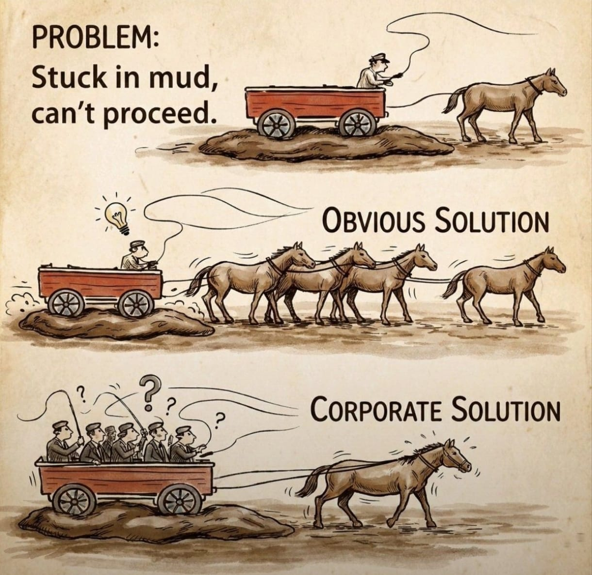

# Estratégia 25 – Substituir vigas e pilares por outros inferiores

Alterar estruturas importantes, como vigas e pilares, por materiais de qualidade inferior, e com isso enfraquecer o inimigo.

Exemplo: Uma vez comprei um carro, que tinha uma lataria muito bonita. Alguns meses depois, problemas começaram a acontecer. O carro ficava acelerado, por conta de uma pecinha que tinha quebrado. A vidro elétrico também quebrou. Depois, o para-brisa. Debaixo da aparência, peças inferiores.

Depois de tal episódio, comprei um Toyota que nunca teve nenhum incidente. A partir daí, só comprei carros desta marca. Tenho a confiança de que todas as peças, por menores que sejam, têm um elevado padrão de qualidade.

É comum times de futebol que têm uma temporada excelente, com titulares e reservas jogando no topo da capacidade. Aí, na temporada seguinte, as estrelas titulares saem, reservas viram titulares, e reservas dos reservas viram os novos substitutos. E, não raro, o desempenho cai enormemente, só em substituir a base de sustentação por outras peças menores.

As vigas e pilares são invisíveis, porém, como dizia o Pequeno Príncipe, "O essencial é invisível aos olhos".

Se a estratégia 18 era sobre o "Líder dos bandidos" e a estratégia 19 "Tirar a lenha de debaixo do caldeirão", a diferença desta é que as vigas e pilares estão ainda mais nas fundações, enquanto as estruturas acima atacam mais o topo.

Um exemplo do mundo corporativo é eliminar postos demais em funções técnicas e operacionais, sobrecarregando os demais a título de "ganho de eficiência".

Curioso que, frequentemente, os salários e compensações dos altos executivos só aumentam. Além disso, é comum a contratação de grandes consultorias, para trazer "as melhores práticas de mercado", comumente aumentando mais ainda a pressão sobre a base...

