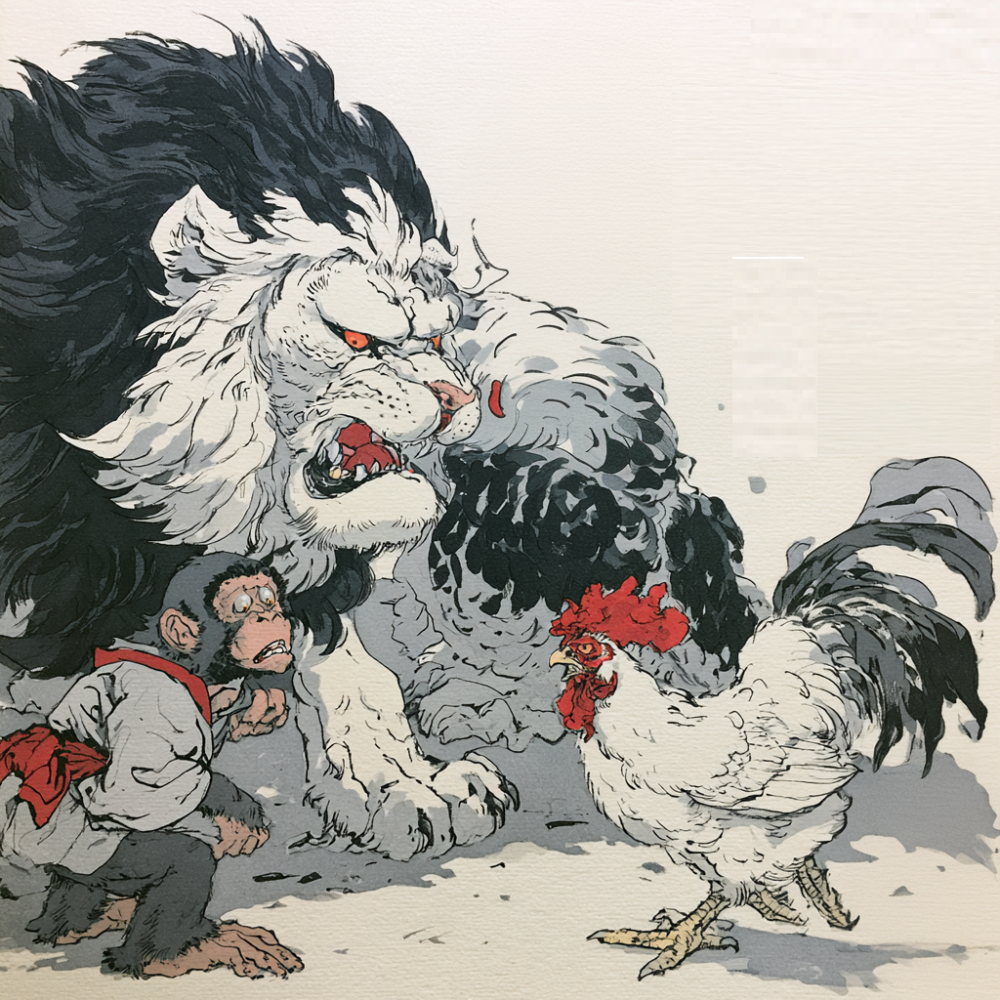

# Estratégia 26 – Apontar para a amoreira, mas repreender a acácia

Consiste em repreender indiretamente, utilizar alguém fraco para mandar a mensagem para alguém forte. Uma variação desta estratégia é “Matar a galinha para assustar o macaco”.

A galinha é muito mais fraca do que o macaco, e matar a galinha tem como objetivo controlar o macaco.