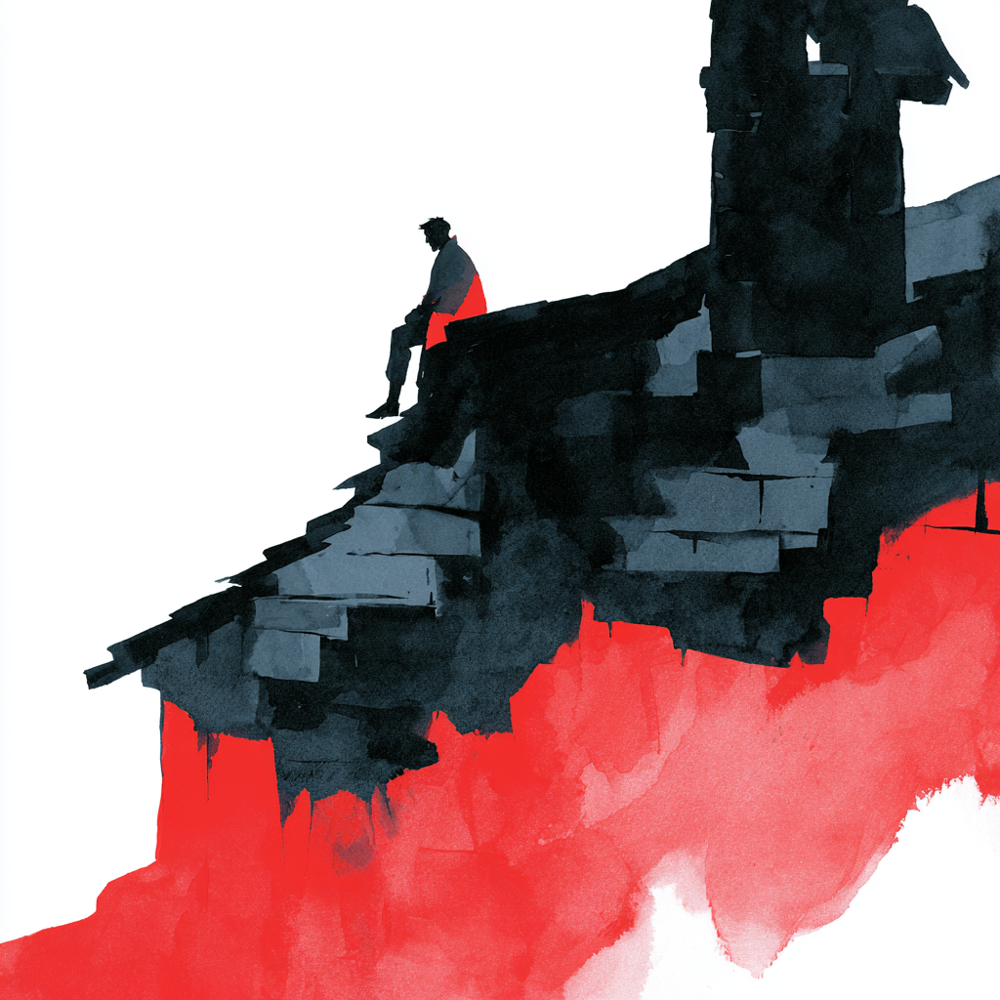
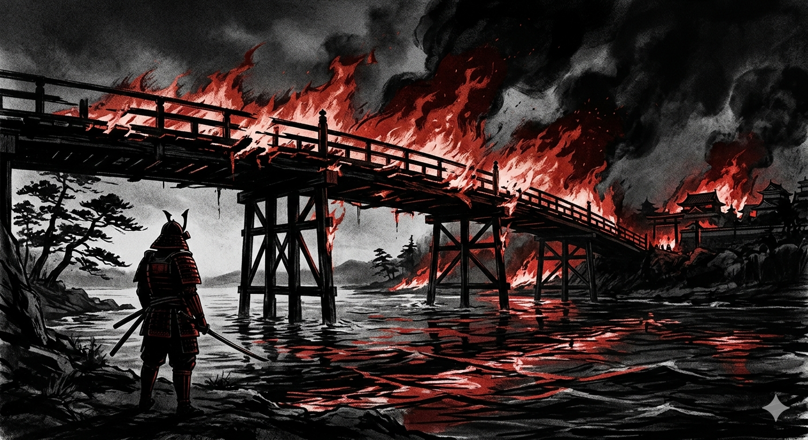

# Estratégia 28 – Tirar a escada depois que o inimigo subir no telhado

Utilizar iscas para atrair o inimigo para uma armadilha. Quando ele estiver subido no telhado, tirar a escada, deixando-o sem saída.

Este estratagema pode ser interpretado de duas formas:
- Atrair o oponente para uma situação que parece boa, porém é uma armadilha
- Colocar-se num ponto de não retorno, o de queimar os próprios navios

Sobre a primeira, uma história chinesa conta sobre dois reinos, o do leste e a do oeste. O rio nascia na parte oeste e passava pelo leste, a caminho do mar. A preocupação do reino do leste era que este era a principal fonte de água, se o reino do oeste desviasse o curso do rio, eles teriam muito a perder.

O reino do oeste, então, garantiu que forneceria um ótimo suprimento de água, sem interromper o rio, e que o reino do leste poderia plantar arroz e pagar uma parte deste em retorno.

Tempos depois, uma vez com os arrozais prontos, seria catastrófico para o reino do leste se o fluxo de água fosse interrompido. A mera ameaça disto já os fazia atender quaisquer pedidos do reino rival.

A estratégia de atrair para subir a escada e depois tirar o suporte é muito comum no mundo do software, com o free trial e as taxas baratas no início, até o dia em que não forem mais. Vide o que ocorre com as LLMs, que torram bilhões de dólares anualmente. Um dia, a conta cheia será repassada aos usuários.

Já a segunda interpretação é a de queimar as duas pontes e navios, colocar-se numa situação desesperada de vencer ou morrer.

O conquistador das Américas Cortez fez isso, queimando navios para impedir qualquer plano B por parte de seu exército, por exemplo.

Sun Tzu também comenta, em sua Arte da Guerra, que um inimigo encurralado não tem nada a perder, portanto lutará até a morte. Ele recomenda que você abra um caminho estreito para fuga ou rendição do oponente, de forma a dar um fio de esperança de um caminho de não luta.

Na vida pessoal, o mesmo ocorre. Lembro de uma vez que troquei de emprego por oportunidade de salário maior, porém o anterior ainda era muito bom em tudo: colegas, potencial. Fiquei um bom tempo "namorando a ex-namorada", até que fui percebendo que era prejudicial a mim: não focava 100% na ocupação presente. A solução foi "queimar a ponte", deixar para trás a alternativa, e dedicar-me de corpo e alma à ocupação atual e futura.

