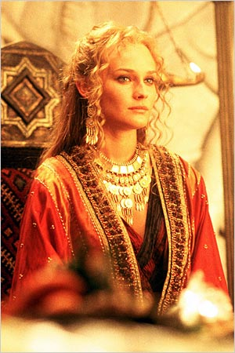

# Estratégia 31 – A trama da beleza

De forma geral, significa focar no ponto fraco do inimigo. Até mesmo os mais poderosos generais (homens) são muito manipuláveis por mulheres bonitas e charmosas.

Igualmente, as mulheres podem ser atraídas por belos varões.

A beleza encanta e é alvo de investigações filosóficas há tempos.

Um belo dashboard com um bom storytelling de dados pode persuadir os diretores de uma empresa, mesmo que os dados em si estejam todos errados.

Exemplos abundam na história. Sansão derrotado por Dalila, Betsabá conquistando o coração de Davi – e colocando o seu filho Salomão no trono, Cleópatra, as sereias hipnotizando os marinheiros, etc…

Helena de Troia, o rosto que mobilizou mil navios.

As maquiagens utilizadas pelas mulheres escondem imperfeições no rosto e têm a beleza física como objetivo. Assim como dietas, roupas e adereços.

Um estudo interessante é o "Amor é cego", capítulo do livro “Dataclisma”, de Christian Rudder. Ele é cofundador de um site de namoros online e comenta preferências humanas, sem filtros, apenas baseados nos dados.

O teste do site foi tirar as fotos do ar por 24h, a fim de estimular os matches sem a dica visual da beleza, apenas com preferências outras. 

Resultados:
- O tráfego no site caiu uns 70%, porque as pessoas insistem em enxergar o par pretendido
- Porém, os matches que ocorreram no teste cego, tiveram maior taxa de sucesso, em termos de métricas de duração (como as conversas durarem 4,4 vezes mais mensagens).

Tudo isso mostra o poder da beleza visual para um primeiro contato, mas não como um indício de relacionamento definitivo, onde o match entre mentalidades é muito mais duradouro.

"A mais antiga de todas as armas é a beleza. Aquilo que parece ser tão belo pode ser tão letal" - Zhao Er Hu

Por fim, uma cena que me vem à mente é a da Mística (transforma do filme X-Men) seduzindo um guarda da prisão do Magneto. Vide:

[https://www.youtube.com/watch?v=i8YvIJVM8Iw](https://www.youtube.com/watch?v=i8YvIJVM8Iw)

A beleza é praticamente irresistível. Ou, como diria o poetinha Vinícius de Moraes: “As feias que me perdoem, mas beleza é fundamental”.

