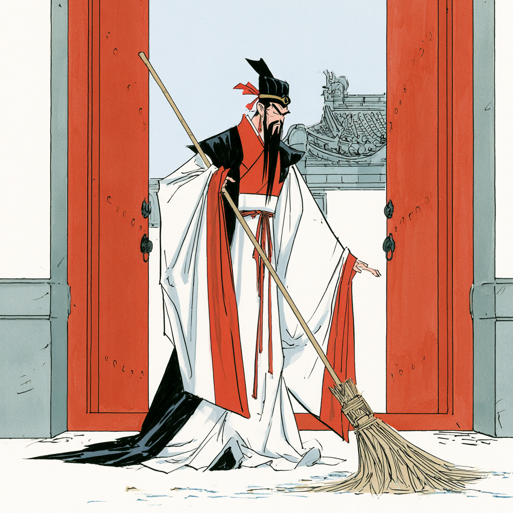

# Estratégia 32 – A trama da cidade vazia

É uma estratégia desesperada, para confundir o inimigo.

Vem de uma história ocorrida com o grande estrategista Zhuge Liang KongMing. Ele estava encurralado pelo inimigo, e fez algo completamente inesperado: simplesmente abriu os portões da cidade, e passou a varrer a entrada, calmamente.

O oponente, que já tinha caído em várias armadilhas de KongMing, desconfiou de alguma trama, e desistiu do ataque.

Para esta estratégia funcionar, deve-se ter bastante conhecimento psicológico sobre o oponente. Saber o que ele vai pensar.

