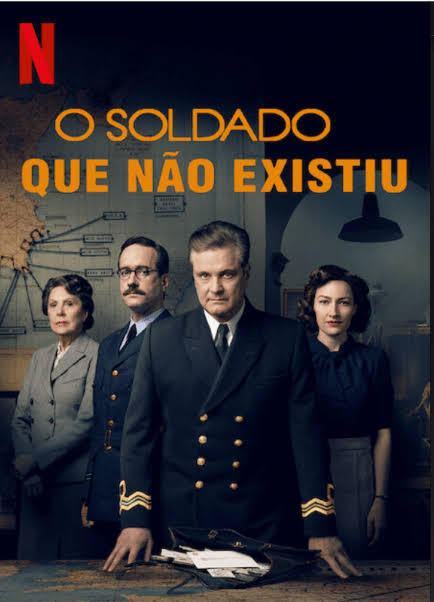
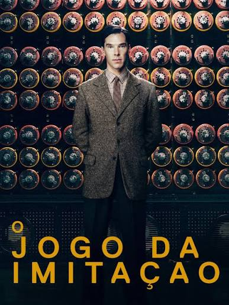

# Estratégia 33 – A manobra do agente duplo

Utilizar o próprio espião do inimigo para disseminar informações falsas.

Sun Tzu dedica um capítulo inteiro da Arte da Guerra para o conceito de espionagem e contra-espionagem. Aqui nas 36 estratégias, não é diferente, informação e contra-informação são a forma de saber o que está acontecendo e planejar ações.

Sun Tzu comenta que informação não pode ser obtida através de adivinhação ou chute. Pessoas devem prover a informação, que será crucial para a tomada de decisão. Elas devem ser bem pagas para conseguir informação que pode ser decisiva, e poupar um gasto infinitamente maior numa operação de guerra mal sucedida.

Um exemplo do uso de espionagem é retratado no filme "O Soldado que Não Existiu". Dois agentes britânicos que usam o cadáver de um homem com documentos falsos para se passar por um oficial carregando segredos militares. 

A desinformação desviou as defesas alemãs para que os Aliados pudessem invadir a Sicília com sucesso.

Caso semelhante ocorreu na época dos Três Reinos, na China antiga. Oficiais de Cao Cao espionaram documentos de um emissário importante de reino rival, que estava de passagem. Os documentos mostraram um plano elaborado para assassinar Cao Cao. O problema é que o plano era falso, mas os resultados foram reais: isto provocou uma concentração errada de energia das tropas, e o ataque foi feito em outro momento e em outro local...

A informação pode decidir guerras. A matemática e a guerra têm uma intersecção num ramo do conhecimento chamado de Criptografia, que consiste em cifrar e decifrar mensagens de forma que apenas o emissor e o receptor consigam entender.

Na Segunda Guerra, Alan Turing e um grupo de matemáticos e engenheiros conseguiram desenvolver métodos para decifrar o Enigma, código de criptografia nazista, considerado indecifrável. Tal feito possibilitou o conhecimento estratégico de locais que os alemães atacariam, além de informação sobre o que eles sabiam ou não (como o local do desembarque do Dia D)

Este feito de Turing é retratado no filme "O jogo da imitação".

Portanto, não economize para obter informação que pode ser crucial na sua decisão!

