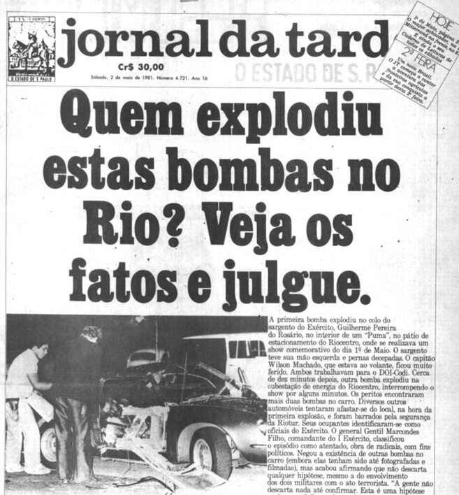

# Estratégia 34 – O método da autolesão

Causar dano a si mesmo, como forma de ganhar a confiança do inimigo. 

Exemplo de um general chinês, que amputou o próprio braço para dizer que tinha sido traído, mas na verdade era apenas um engodo para se infiltrar entre os oficiais do inimigo.

A arte da guerra chinesa também comenta de um oficial, que sacrificou a própria família, a fim de justificar uma falsa deserção para o lado inimigo. Uma vez ganhando a confiança e chegando a um alto posto, ele assassinou o rei inimigo, que era o seu verdadeiro propósito desde o início.

É estratégia comum o chamado "false flag". Um atentado causado contra si mesmo, a fim de culpar o inimigo e iniciar hostilidades. Um caso famoso no Brasil é o do Riocentro, em 1981, em que militares tentaram detonar bombas no centro de convenções Riocentro.  

Porém, o plano deu errado, as bombas explodiram no estacionamento, e a imprensa divulgou ostensivamente o fato.

A falsa modéstia é uma variação do método. Criticar-se a si mesmo, colocar-se abaixo dos outros, em sinal de humildade, que pode ser falsa.

Interessante caso é o do humor. Uma das teorias é o da superioridade: rimos e nos sentimos bem quando nos sentimos superiores a outrem. É por isso que há tantas piadas sobre outros povos, raças, orientação sexual, gênero oposto, etc.

Uma forma melhor de fazer humor é o de se auto-depreciar: contar ocasião em que você se deu mal, que errou ou se confundiu, em tom cômico. É uma forma de ganhar simpatia imediata do outro lado.

