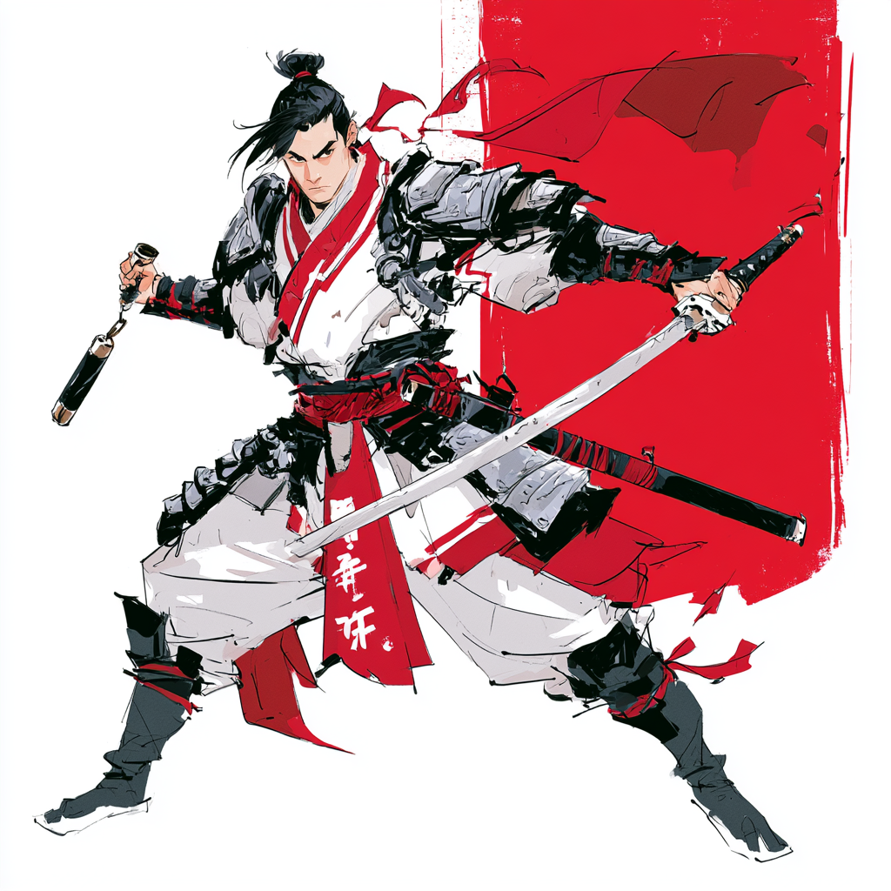

# Estratégia 35 – Manobras interligadas

Utilização conjunta, serial ou paralela, das estratégias descritas acima. Saber cada uma das estratégias é bom, mas saber qual utilizar, quando, onde e como, é a verdadeira Arte da Guerra.

