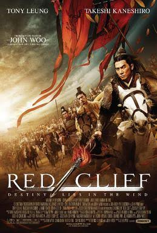

# Estratégia 35 – Manobras interligadas

Utilização conjunta, serial ou paralela, das estratégias descritas acima.

Uma interpretação é a interligar. Esta ideia vem de um célebre episódio dos Três Reinos, onde o exército de Cao Cao atacava o reino de Shu Han, a batalha do penhasco vermelho. O exército atacante estava acostumado a batalhas em terra, não em navios, e a batalha tem que ser por via fluvial.

Um agente infiltrado recomenda uma solução que parece boa: interligar os navios, de forma que eles balancem menos e os soldados fiquem menos enjoados.

Porém, havia uma armadilha. Navios interligados tinham maior dificuldade de fugir, em caso de ataque com fogo. O grande estrategista Kong Ming planejou um ataque com fogo, no único dia do ano em que o vento estaria a favor. Isto destruiu completamente a frota atacante.

O filme Red Cliff retrata a batalha citada.

As big techs utilizam tal estratégia. A Microsoft tem os tradicionais Excel, Power Point, mas também Outlook, Teams e uma quantidade enorme de ferramentas que talvez nem utilizemos. Para concorrer com tal gama gigantesca de ferramentas, o concorrente tem que ou ser muito bom no que faz de forma específica, ou ter também um leque enorme de ferramentas.

O Google tem o GCP (cloud), e-mail, mas também tem as suas versões de Excel (Sheets), Power Point (slides) e outros. Alguns desses são superiores e outros inferiores, mas a ideia é ter um bloco interconectado, difícil de atacar.

A Apple tem um enorme bloco de software, hardware e serviços interconectados, como armazenamento de fotos, streaming de vídeo, celular, relógio, e tudo funciona só se estiver no seu ecossistema (fora dele até funciona, mas de forma inferior). Para o cliente que já está dentro sair, teria que migrar praticamente tudo.

Os animais também formam blocos. Búfalos, que cercam os seus filhotes contra o ataque de lobos. Manadas onde o próprio volume é uma defesa contra eventuais ataques.

Saber cada uma das estratégias é bom, mas saber qual utilizar, quando, onde, como e quais é a verdadeira Arte da Guerra.