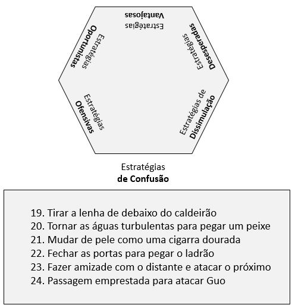

# Estratégias de Confusão

Compreendem as estratégias de 19 a 24.

[19 – Tirar a lenha de debaixo do caldeirão.](estrategia_19.qmd)

[20 – Tornar as águas turbulentas para pegar um peixe.](estrategia_20.qmd)

[21 – Mudar de pele como uma cigarra dourada.](estrategia_21.qmd)

[22 – Fechar as portas para pegar o ladrão.](estrategia_22.qmd)

[23 – Fazer amizade com o distante e atacar o próximo.](estrategia_23.qmd)

[24 – Passagem emprestada para atacar Guo.](estrategia_24.qmd)
