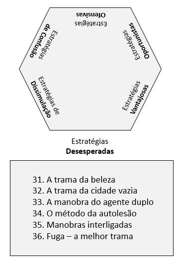

# Estratégias Desesperadas

Compreendem as estratégias de 31 a 36.

[31 – A trama da beleza.](estrategia_31.qmd)

[32 – A trama da cidade vazia.](estrategia_32.qmd)

[33 – A manobra do agente duplo.](estrategia_33.qmd)

[34 – O método da autolesão.](estrategia_34.qmd)

[35 – Manobras interligadas.](estrategia_35.qmd) 

[36 – Fuga – a melhor trama.](estrategia_36.qmd)