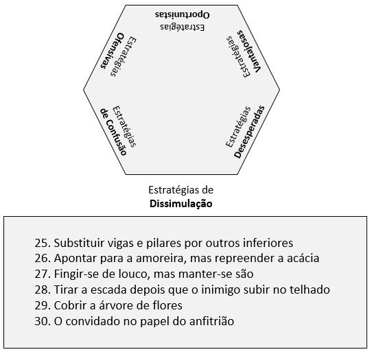

# Estratégias de Dissimulação

Compreendem as estratégias de 25 a 30.

[25 – Substituir vigas e pilares por outros inferiores.](estrategia_25.qmd)

[26 – Apontar para a amoreira, mas repreender a acácia.](estrategia_26.qmd)

[27 – Fingir-se de louco, mas manter-se são.](estrategia_27.qmd) 

[28 – Tirar a escada depois que o inimigo subir no telhado.](estrategia_28.qmd)

[29 – Cobrir a árvore de flores.](estrategia_29.qmd)

[30 – O convidado no papel do anfitrião.](estrategia_30.qmd)