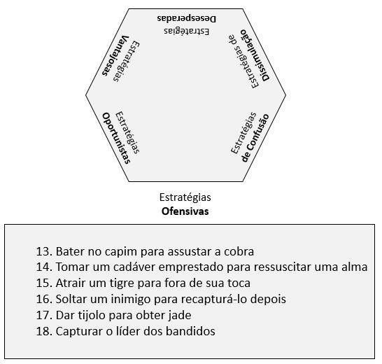

# Estratégias Ofensivas

Compreendem as estratégias de 13 a 18.

[13 – Bater no capim para assustar a cobra.](estrategia_13.qmd)

[14 – Tomar um cadáver emprestado para ressuscitar uma alma.](estrategia_14.qmd)

[15 – Atrair um tigre para fora de sua toca.](estrategia_15.qmd)

[16 – Soltar um inimigo para recapturá-lo depois.](estrategia_16.qmd)

[17 – Dar tijolo para obter jade.](estrategia_17.qmd)

[18 – Capturar o líder dos bandidos.](estrategia_18.qmd)

