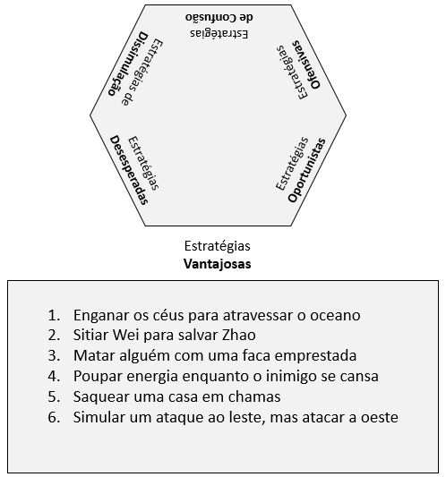

# Estratégias Vantajosas

Compreendem as estratégias de 01 a 06.

[1 – Enganar os céus para atravessar o oceano.](estrategia_01.qmd)

[2 – Sitiar Wei para salvar Zhao.](estrategia_02.qmd)

[3 – Matar alguém com uma faca emprestada.](estrategia_03.qmd)

[4 – Poupar energia enquanto o inimigo se cansa.](estrategia_04.qmd)

[5 – Saquear uma casa em chamas.](estrategia_05.qmd)

[6 – Simular um ataque ao leste, mas atacar a oeste.](estrategia_06.qmd) 