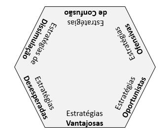

# Introdução {.unnumbered}
A China tem mais de 5 mil anos de história, e muito desta história é de guerras.

O tratado chinês de guerra mais conhecido é a fabulosa “A Arte da Guerra”, de Sun Tzu, entretanto, não é o único. Muito pelo contrário, há vários tesouros escondidos…

O livro “36 estratégias secretas de guerra” é uma valiosa compilação de vários ensinamentos de guerra. O autor desta obra é desconhecido, assim como o período em que foi escrito, e também há mais de uma versão deste tratado.

O número 36 não é por acaso.

Comumente, divide-se os 36 estratagemas em 6 grupos de 6, mostrados a seguir.

Cada capítulo deste e-book focará em um dos estratagemas.

Desfrute desta joia escondida!

